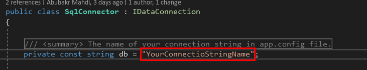

# Dapper DAL Project

this is a visual studio project template , that creates a c# library project with classes and interfaces and methods to work as "Data Access Layer" , using Dapper ORM.

## Preview


## How To Use?


### Part One : Setup Projects 

#### First Setup Your Project 


1.Create your  project.

2.Open  your project app.config file add the connection string of your server.


#### Second Setup your Dapper Project

- Open DataAccess\SqlConnector.cs File and change the db const varibale value to your connection string name in your app.config file.




### Part Two : Wire Up Projects

1.Add the dapper DAL library as reference in your project.

2.Open your program.cs or any file you want to use as connection Initializer in your project, and add this code :

**NOTE:** First add using statment for the dapper library.

```CSharp
GlobalConfig.InitializeConnection(new SqlConnector());
```

### Part Three : Perform Action on Data Base

Use ```Create(dataModel,commandText,commandType)``` method to insert , update , delete in your database, and use
```Get(commandText,commandType)``` method to get data from database.
those methods are implemented from ```IDataConnection``` interface in ```SqlConnector``` class.

this is how they look like :

```CSharp
public T Create<T>(T model, string commandText, CommandType commandType = CommandType.StoredProcedure)
        {
            using (IDbConnection connection = new System.Data.SqlClient.SqlConnection(GlobalConfig.GetConnectionString(db)))
            {

                connection.Execute(commandText, DapperHelper.GenerateParameters(model,false), commandType: commandType);

                return model;
            }
        }

        public List<T> Get<T>(string commandText, CommandType commandType = CommandType.StoredProcedure)
        {
            List<T> output = new List<T>();

            using (IDbConnection connection = new System.Data.SqlClient.SqlConnection(GlobalConfig.GetConnectionString(db)))
            {

               output =  connection.Query<T>(commandText, commandType: commandType).AsList();

                return output;
            }
        }
```


To use them , for example you have person model class look like this :

```CSharp

public class PersonModel
{

public int Id {get;set;}

public string FullName {get;set;}

public string Address {get;set;}

}
```

Say that we have stored procedure called ``` spPerson_Insert``` and an other one called ```spPerson_Get```,
to create new person in your data base you have to do this :

```
PersonModel p = new PersonModel { Id = 1 , FullName = "Abubakr" , Address = "Sudan" };
GlobalConfig.Connection.Create(p,"spPerson_Insert",CommandType.StoredProcedure);
```

use the same way with ```Get()``` method.


```CSharp
List<PersonModel> people =  GlobalConfig.Connection.Get("spPerson_Get",CommandType.StoredProcedure)
```


## license 

MIT license
